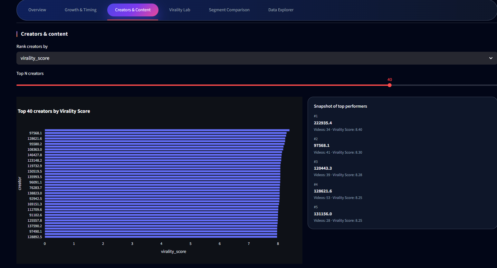
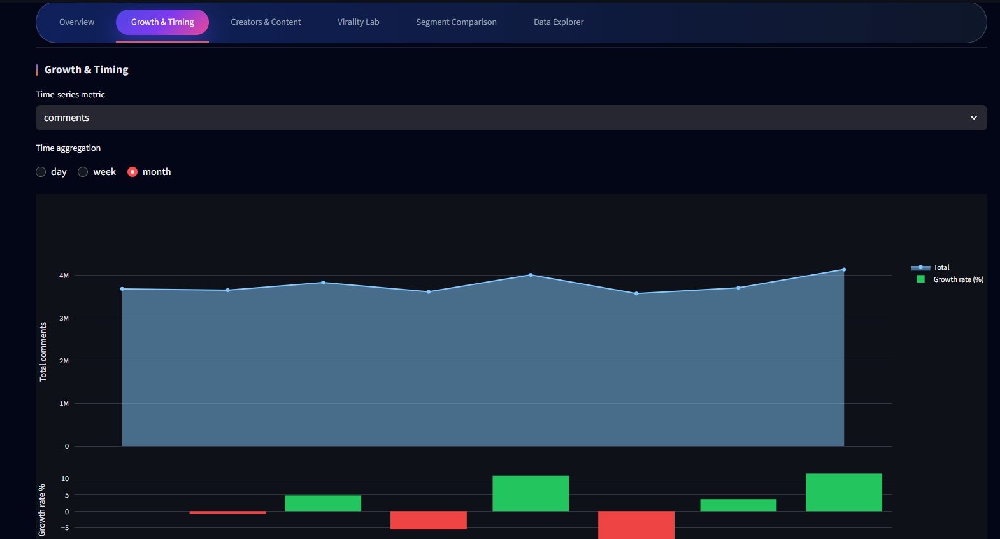
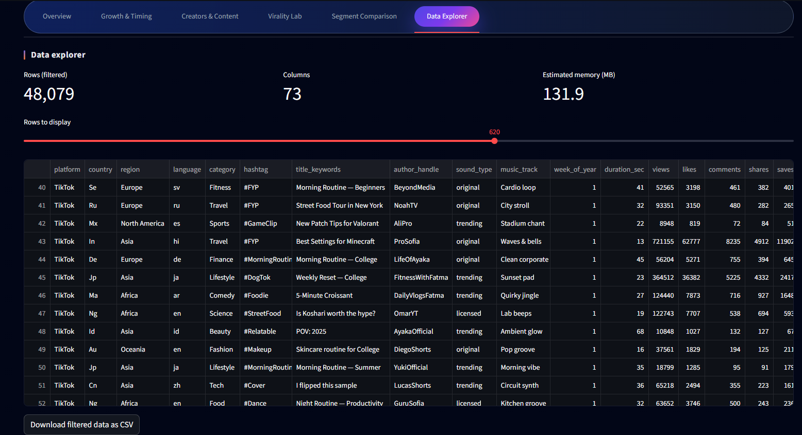

# 📺 Short-Video Intelligence Dashboard 🎬
### Creators 👤 • Virality 🚀 • Timing ⏱️ • Segments 🧩 (Decision-Ready Analytics ✅)

[](https://streamlit.io/)


A production-style **Streamlit** dashboard that turns “one row per video” datasets into actionable signals:
**creator performance**, **timing patterns**, **virality scoring**, and **segment benchmarks**.

---

## 🎥 Preview






---

## ✨ Key capabilities

- 🧠 **Auto-maps common fields** (views, likes, comments, shares, publish time, platform, creator, category, country, duration).
- 🧮 Computes **derived metrics** (engagement rates, virality score, performance tiers, viral potential).
- 🧭 Decision views for:
  - 📈 **Growth & timing** (day/week/month trends + posting windows)
  - 🏆 **Creators & content** (leaderboards + mix)
  - 🧪 **Virality lab** (threshold + candidates)
  - 🧩 **Segment comparison** (benchmarks by platform/country/category/etc.)
  - 🔎 **Data explorer** (preview + export filtered CSV)

---

## 🧱 Project structure

```text
.
├─ app.py
├─ short_video_intel/
│  ├─ config.py
│  ├─ data.py
│  ├─ metrics.py
│  ├─ theme.py
│  └─ ui.py
├─ data/
│  └─ youtube_shorts_tiktok_trends_2025.csv
├─ assets/
│  └─ (screenshots)
├─ tests/
├─ .streamlit/
├─ requirements.txt
├─ requirements-dev.txt
└─ pyproject.toml
```

---

## 🧾 Input data

The app works best when your dataset includes columns similar to:

| Concept | Example column names |
|---|---|
| Views 👀 | `views`, `view_count`, `play_count` |
| Likes 👍 | `likes`, `like_count` |
| Comments 💬 | `comments`, `comment_count` |
| Shares 🔁 | `shares`, `share_count` |
| Duration (sec) ⏳ | `duration`, `duration_sec`, `video_length` |
| Publish time 🗓️ | `publish_date`, `published_at`, `timestamp` |
| Platform 📱 | `platform`, `source`, `app` |
| Creator / Account 👤 | `creator`, `author`, `channel`, `username`, `handle` |
| Category / Topic 🏷️ | `category`, `topic`, `tag` |
| Country / Region 🌍 | `country`, `region`, `market`, `geo` |
| Hashtags #️⃣ | `hashtags`, `tags`, `hashtag` |

Notes:
- 🧩 Naming doesn’t have to match exactly — the app uses best-effort **auto-detection**.
- ⏱️ Time fields are parsed into **day/week/month** for trends and into **hour/day-of-week** for timing patterns.

---

## ⚙️ Quick start

```bash
python -m venv .venv

# Windows
.venv\Scripts\activate

# macOS / Linux
source .venv/bin/activate

pip install -r requirements.txt
streamlit run app.py
```

---

## ✅ Quality checks (recommended)

```bash
pip install -r requirements-dev.txt

ruff check .
ruff format . --check
pytest -q
```

---

## 🐳 Docker

```bash
docker build -t short-video-intel .
docker run --rm -p 8501:8501 short-video-intel
```

---

## 🚀 Deployment notes

### ☁️ Streamlit Community Cloud
- Main file: `app.py`
- Requirements: `requirements.txt`

### 🤗 Hugging Face Spaces (Streamlit)
This repo is compatible as-is:
- `app.py`
- `requirements.txt`
- `.streamlit/config.toml`

---

## 📄 License

- **Code**: Apache 2.0 (see `LICENSE`)
- **Sample data**: included for demo. If you replace it with real platform exports, ensure you have the right to publish and redistribute that data.
