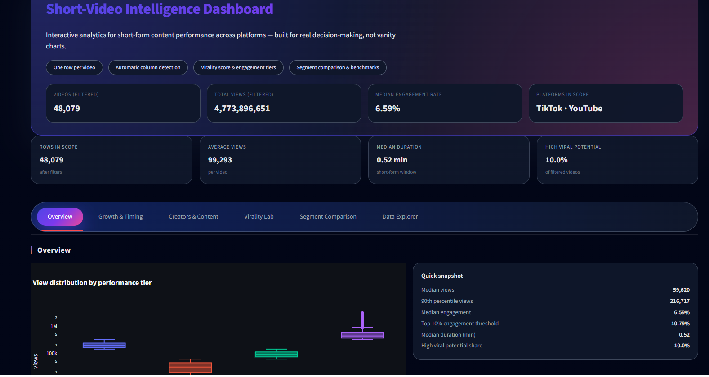
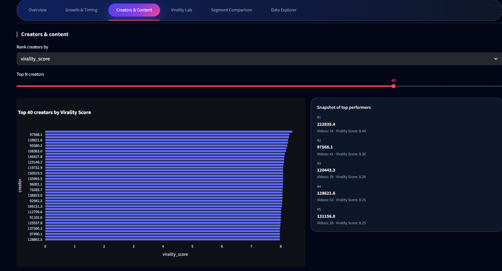
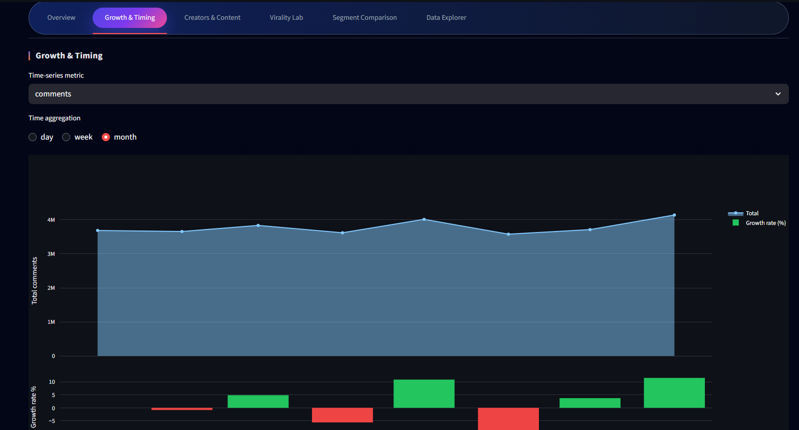
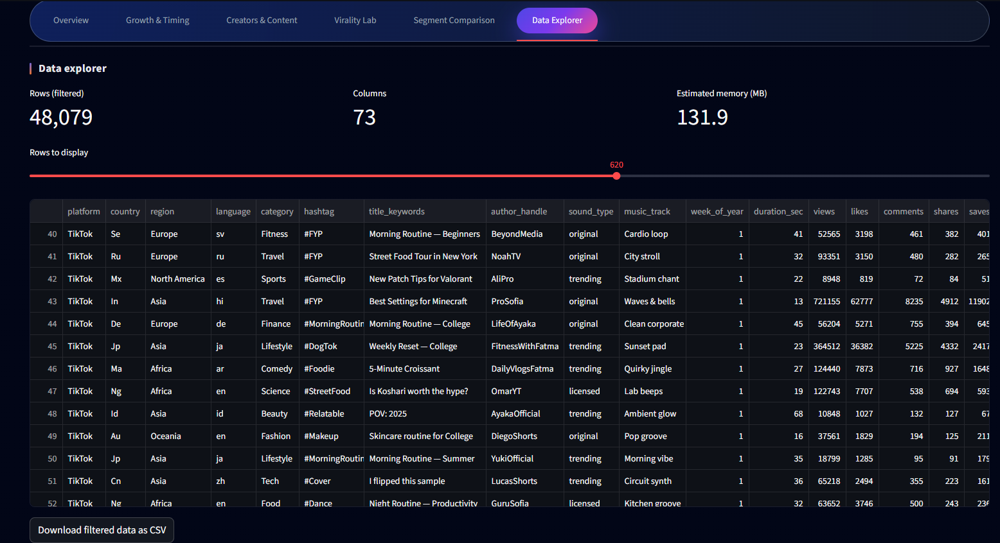

# 📺 Short-Video Intelligence Dashboard

### Creator performance, virality scoring, timing patterns, and segment benchmarks

[](https://streamlit.io/)


A production-style Streamlit dashboard that turns one-row-per-video datasets into actionable signals for creator performance, timing patterns, virality scoring, and segment benchmarks.

The app is designed for short-form video analytics workflows where teams need to move from raw platform exports to decision-ready views: which creators are performing, which posting windows matter, which segments are gaining traction, and which videos are likely breakout candidates.

---

## 🎥 Preview









---

## ✨ Key capabilities

- Auto-maps common fields: views, likes, comments, shares, publish time, platform, creator, category, country, duration, and hashtags.
- Computes derived metrics: engagement rates, virality score, performance tiers, and viral potential.
- Provides growth and timing views across day, week, month, posting hour, and day-of-week patterns.
- Ranks creators and content using engagement, reach, posting volume, and virality signals.
- Supports configurable virality thresholds for candidate discovery.
- Compares segments across platform, country, category, creator, and other available dimensions.
- Includes a filtered data explorer with CSV export for downstream review.

---

## 🧭 What this dashboard helps answer

- Which creators and segments are driving the strongest engagement?
- Which posting windows show better reach or interaction patterns?
- Which videos are likely breakout candidates based on configurable virality thresholds?
- How do platforms, countries, categories, and content types compare against each other?
- Which records should be exported for deeper analysis, reporting, or operational review?

---

## 🧱 Project structure

```text
.
├─ app.py
├─ short_video_intel/
│  ├─ __init__.py
│  ├─ config.py
│  ├─ data.py
│  ├─ metrics.py
│  ├─ theme.py
│  └─ ui.py
├─ data/
│  └─ youtube_shorts_tiktok_trends_2025.csv
├─ assets/
│  ├─ short-video-overview.png
│  ├─ creators-virality-leaderboard.png
│  ├─ monthly-comments-growth.png
│  └─ data-explorer-view.png
├─ tests/
│  ├─ conftest.py
│  ├─ test_data.py
│  └─ test_metrics.py
├─ .github/
│  └─ workflows/
│     └─ ci.yml
├─ .streamlit/
│  └─ config.toml
├─ CASE_STUDY.md
├─ DATASET_CARD.md
├─ CHANGELOG.md
├─ Dockerfile
├─ LICENSE
├─ requirements.txt
├─ requirements-dev.txt
└─ pyproject.toml
```

---

## 🧾 Input data

The app works best when your dataset includes columns similar to the following concepts.

| Concept | Example column names |
|---|---|
| Views | `views`, `view_count`, `play_count` |
| Likes | `likes`, `like_count` |
| Comments | `comments`, `comment_count` |
| Shares | `shares`, `share_count` |
| Duration in seconds | `duration`, `duration_sec`, `video_length` |
| Publish time | `publish_date`, `published_at`, `timestamp` |
| Platform | `platform`, `source`, `app` |
| Creator or account | `creator`, `author`, `channel`, `username`, `handle` |
| Category or topic | `category`, `topic`, `tag` |
| Country or region | `country`, `region`, `market`, `geo` |
| Hashtags | `hashtags`, `tags`, `hashtag` |

Notes:

- Column names do not have to match exactly. The app uses best-effort auto-detection for common naming patterns.
- Time fields are parsed into day, week, and month for trend views.
- Time fields are also used to derive posting hour and day-of-week patterns when available.
- If optional fields are missing, the app keeps the relevant views available where possible and avoids hard failures for non-critical columns.

---

## ⚙️ Quick start

Create and activate a virtual environment:

```bash
python -m venv .venv
```

Windows:

```bash
.venv\Scripts\activate
```

macOS / Linux:

```bash
source .venv/bin/activate
```

Install dependencies and run the app:

```bash
python -m pip install --upgrade pip
pip install -r requirements.txt
python -m streamlit run app.py
```

The app should open locally at:

```text
http://localhost:8501
```

To avoid conflicts with another local Streamlit app, run on a dedicated port:

```bash
python -m streamlit run app.py --server.port 8503
```

---

## ✅ Quality checks

The GitHub Actions workflow runs a stable validation set:

```bash
python -m compileall -q app.py short_video_intel tests
python -m pytest -q
```

For local checks, install runtime and development dependencies first:

```bash
pip install -r requirements.txt -r requirements-dev.txt
python -m compileall -q app.py short_video_intel tests
python -m pytest -q
```

Expected result:

```text
7 passed
```

---

## 🐳 Docker

Build the image:

```bash
docker build -t short-video-intel .
```

Run the container:

```bash
docker run --rm -p 8501:8501 short-video-intel
```

Then open:

```text
http://localhost:8501
```

If port `8501` is already in use:

```bash
docker run --rm -p 8503:8501 short-video-intel
```

Then open:

```text
http://localhost:8503
```

---

## 🚀 Deployment notes

### Streamlit Community Cloud

Use the following settings:

- Main file: `app.py`
- Python dependencies: `requirements.txt`

### Hugging Face Spaces

This repository is compatible with a Streamlit Space using:

- `app.py`
- `requirements.txt`
- `.streamlit/config.toml`

Recommended Space settings:

```yaml
sdk: streamlit
app_file: app.py
```

---

## 📄 License and data note

- Code: Apache 2.0. See `LICENSE`.
- Bundled sample data: included as a reproducible example for dashboard evaluation. See `DATASET_CARD.md`.
- Real platform exports should remain private unless privacy, platform terms, and redistribution rights are verified.
- Do not publish private creator, account, platform, or campaign exports without explicit permission and appropriate anonymization.
